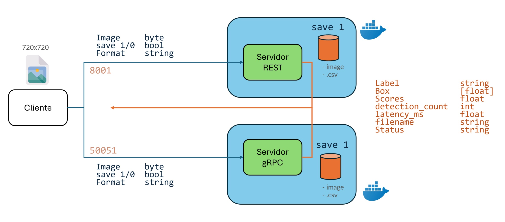
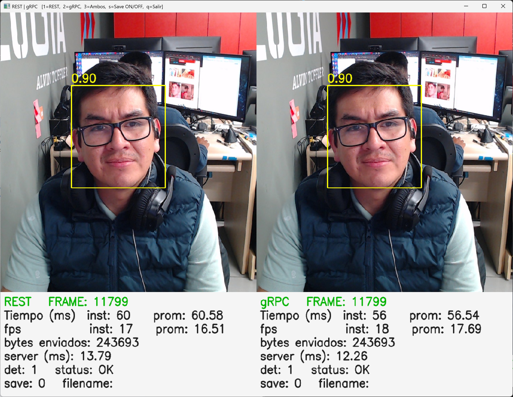

# REST vs gRPC para inferencia de imágenes en tiempo real

Etapa de Optimización del Trabajo Final de Trabajo Operaciones de aprendizaje automático II
- Jorge Chavez Arias 
- Jorge Cuenca Marin

Comparación práctica entre **REST (FastAPI)** y **gRPC (HTTP/2 + Protobuf)** para **inferencia de imágenes** (detección de rostros) en tiempo real.  
Los **servidores corren en Docker** y ya incluyen los **stubs gRPC**.

## Requisitos
- **Docker** + **Docker Compose**
- **Python 3.9–3.11** solo para el **cliente local** (webcam + GUI)

## Arquitectura



## Demo


  


## Cómo correr

### 1) Clonar el repositorio
```bash
git clone https://github.com/heyulch/inferbench-rest-grpc-vision.git
cd inferbench-rest-grpc-vision
```

### 2) Levantar servidores (Docker)
```bash
docker-compose up --build -d
# Verifica:
docker-compose ps
```

- REST en: localhost:8001
- gRPC en: localhost:50051

Las imágenes guardadas y el CSV se montan en:

- rest_service/storage/
- grpc_service/storage/

### 3) Ejecutar cliente (local)

Instala dependencias mínimas para el cliente y corre:
```bash
# (opcional) entorno virtual

pip install opencv-python==4.10.0.84 numpy==1.26.4 requests==2.32.3 grpcio==1.64.1

python client/clientgui.py
```

### Controles del cliente
- 1 → solo REST
- 2 → solo gRPC
- 3 → ambos
- s → guardar ON/OFF (servidor guarda imagen 720×720 + CSV)
- r → resetear métricas
- q / Esc → salir

### ¿Qué hace?

- El cliente toma frames de la webcam (1280×720) y los envía como JPEG a REST y/o gRPC.

- En el servidor:

    - Recorta centrado a 720×720, redimensiona a 300×300 para el detector Haar (OpenCV).
    - Reescala las cajas a 720×720 y devuelve resultados.
    - Si save=1, guarda la imagen 720×720 en storage/ y una fila en storage/records.csv con metadatos.


# Resultados 

- gRPC suele tener menor latencia por usar Protobuf binario y HTTP/2.
- REST es más fácil de integrar y depurar.
- gRPC es ideal para alto volumen de datos.


## Estructura del repositorio
```
├── client/                         # Cliente local (ejecuta la webcam)
│   ├── proto/                      # Definición del servicio gRPC
│   │   └── img_service.proto
│   ├── clientgui.py                # Versión GUI o alternativa del cliente
│   ├── img_service_pb2.py          # Stub gRPC generado 
│   ├── img_service_pb2_grpc.py     # Stub gRPC generado 
│   └── pyproject.toml              # Configuración Poetry
│
├── docs/                           # Documentación y recursos gráficos
│
├── grpc_service/                   # Servidor gRPC
│   ├── proto/
│   │   └── img_service.proto       # Esquema Protobuf
│   ├── storage/                    # Carpeta para guardar inferencias
│   ├── Dockerfile                  # Imagen del servidor gRPC
│   ├── img_service_pb2.py          # Stub gRPC
│   ├── img_service_pb2_grpc.py     # Stub gRPC 
│   ├── main.py                     # Servidor gRPC principal
│   ├── poetry.lock                 # Dependencias Poetry 
│   └── pyproject.toml              # Configuración Poetry
│
├── rest_service/                   # Servidor REST (FastAPI)
│   ├── storage/                    # Carpeta para inferencias e imágenes guardadas
│   ├── Dockerfile                  # Imagen del servidor REST
│   ├── main.py                     # Servidor FastAPI principal
│   └── pyproject.toml              # Configuración Poetry
│
├── docker-compose.yml              # Orquestador de los dos servicios
├── README.md                       # Documento principal del proyecto
└── requirements.txt                # Requisitos compartidos (para Docker)
```

## Adicional

Si se necesita cambiar los datos enviados o recibidos pueden modificar los archivos proto y luego: 

Borrar 
- img_service_pb2.py
- img_service_pb2_grpc.py

Y nuevamente generarlos:
```bash
poetry run python -m grpc_tools.protoc -I./proto --python_out=. --grpc_python_out=. ./proto/img_service.proto
```
Para el servidor gRPC, se recomienda modificar archivos proto y volver a generar todo el Docker.